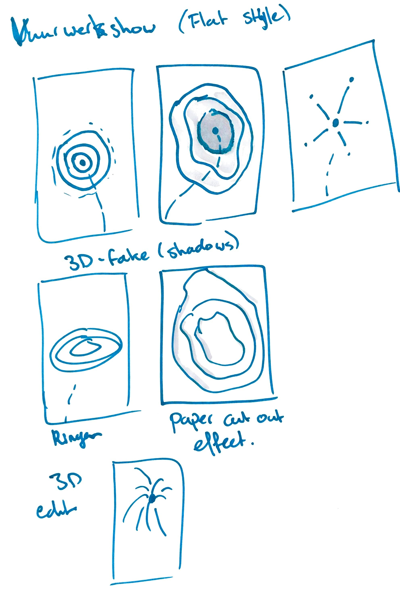

## Kai van Wezel

### CSS to the Rescue @cmda-minor-web 2021 - 2022

---

# Eindopdracht: Magische vuurwerkshow

### Planning

<table>
<tr>
<th>Week 1</th>
<td>

- [ ] kennismaken CSS-technieken
- [ ] Presentatie/kennismaking
- [ ] Eindopdracht kiezen + schetsen

</td>

</tr>
<tr>
<th>Week 2</th>
<td>

- [x] Ideeën afmaken
- [x] Interactie bedenken
- [x] Oefenen met animeren voor explosies

</td>
</tr>
<tr>
<th>Week 3</th>
<td>

- [x] Eerste paar _explosies_ maken
- [x] Inschatten einddoel
- [x] Interactie implementeren

</td>
</tr>
<tr>
<th>Week 4</th>
<td>

- [ ] Tweaken animaties
- [ ] Interactie controleren
- [ ] Code finaliseren

</td>
</tr>
</table>

## Week 1

Ik heb gekozen voor de opdracht _magische vuurwerkshow_. Mij doel is om uiteindelijk een 3d-vuurwerkbol te creëren. Ik ben nog aan het uitzoeken of dit mogelijk is maar in mijn hoofd wel. Ik wil eerst oefenen met het maken van animaties van de vuurwerkexplosie. Een 'ripple'-effect en vanaf daar steeds verder uitbreiden. Op deze manier kan ik ook per pijl mijn leertraject laten zien. De pijlen worden steeds mooier en complexer als het goed is.
Een leuke interactie moet ik nog bedenken maar ik heb al wel een idee. Zo wil ik dat je de show zelf kan samenstellen met checkboxes.

De uitdaging voor mij zit hem in het animeren, ik heb wel met transities gewerkt voor bijvoorbeeld de _hover_ state, maar nog nooit keyframes in de praktijk gebruikt. Wel heb ik al enige ervaring met CSS dus de uitdaging hoog houden is wel een must. Daarom wil ik dus de 3D-bol gaan maken.

### Schetsen/ideeën

---

## Week 2

Voor deze week wil ik beginnen met het maken van mijn eerste vuurwerkje en de animatie daarvan goed hebben. Ik ben simpel begonnen met het idee rechtsboven in mijn ideeënschets. Eerst het bommetje laten vliegen en daarna de staarten van het vuurwerk animeren. Daar kwam het volgende uit:

<table>
    <tr>
    <td>HTML</td>
    <td>CSS custom props</td>
    <td>Animation keyframes</td>
    </tr>
</table>

Nu ik een beetje het idee van vuurwerk in mijn hoofd heb ben ik gaan nadenken over wat voor interactie er in moet zitten.

Ik wil in ieder geval een optie maken om zelf de vuurwerkjes af te vuren als je op een knop drukt. Per vuurwerkje is er een knop waar je op kan drukken die het bijbehorende vuurwerkje de lucht in schiet.

---

## Week 3

### Vuurwerkje 2

In week 3 heb ik niet zo heel veel kunnen doen. Ik ben ziek geweest maar ben in het weekend wel verder gegaan met mijn ideeën. Ik wilde het vuurwerkje linksboven in mijn ideeënschets gaan maken. Door een soort ripple-effect te creëren hoopte ik tot mooie _expanding_ ringen te komen.

Terwijl ik een manier zocht om deze ringen te krijgen en ook te animeren kwam ik een ander [voorbeeld](https://codepen.io/dmgig/pen/LRNpXN) tegen op internet wat mij nog meer aansprak. Deze hypnose/kaleidoscoop die ik ook bij Sanne heb gezien sprak mij aan.

Ik ben gaan experimenteren met hoe je kleuren kan mixen en wat voor resultaten dat oplevert.
De `mix-blend-mode` property is fantastisch voor het mixen van kleuren en biedt een hoop mogelijkheden voor dit vuurwerkje.

Eerst in zwart-wit, toen met kleur en daarna gradients gebruikt om die kaleidoscoop zo vet mogelijk te krijgen.

<table>
    <tr>
    <td>2.0 B&W</td>
    <td>2.1 Color</td>
    <td>2.2 Gradient</td>
    </tr>
</table>

### Vuurwerkje 3
